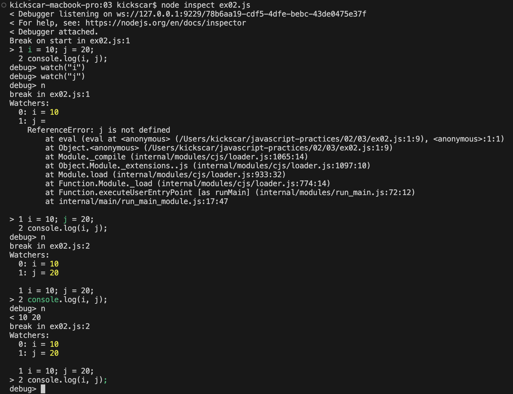
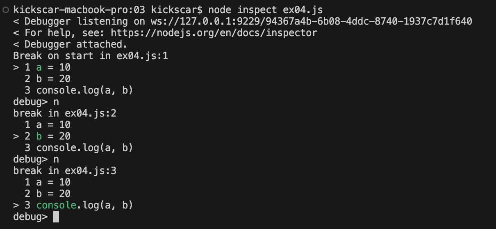
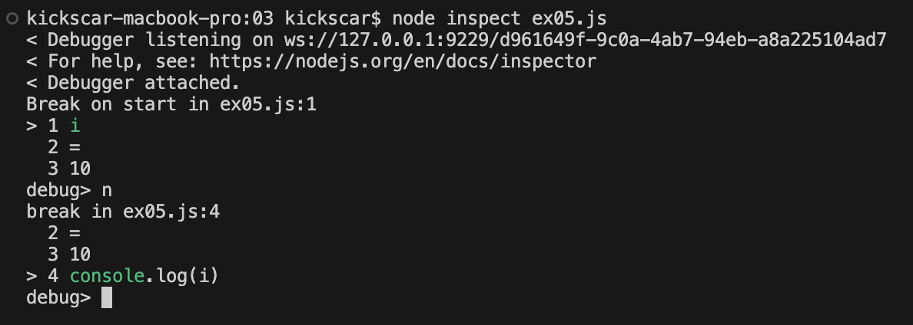
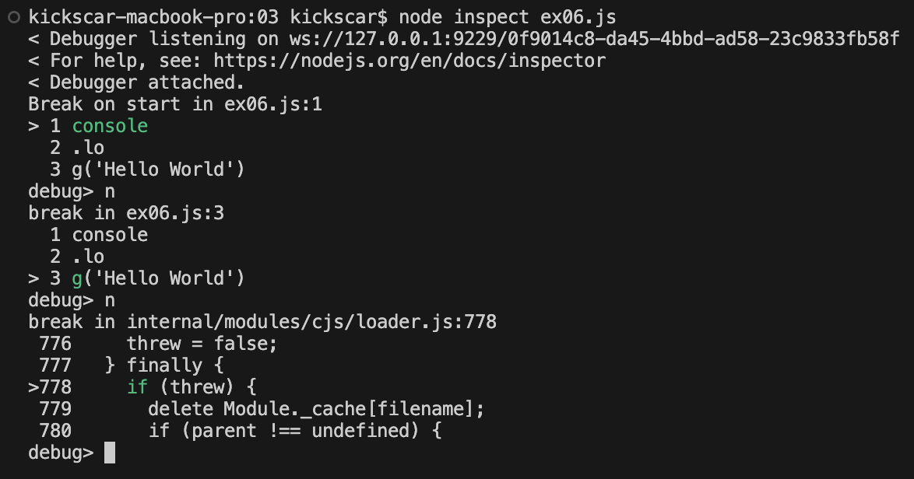

## 구문(Statement)

 구문이 중요한 이유는 구문이 자바스크립트의 실행 단위이기 때문이다. 자바스크립트 엔진 내부의 파서(parser)라고도 부르는 어휘 분석기가 코드의 어휘 분석을 통해 토큰을 분리하고 적당한 개수의 토큰들을 모아 실행한다. 따라서 적당한 개수의 토큰 모음이 구문이 된다. 이 적당한 개수의 토큰 모음은 어휘적 조건인 문법(syntax)을 만족하는 옳은 순서와 의미를 가져야 한다. 구문은 다음과 같은 것들로 구성될 수 있다.

1.  값(Value)
2.  연산자(Operator)
3.  표현식(Expression)
4.  주석(Comment)
5.  예약어(Keyword)

 여기서 주석문이라 부르는 주석은 구문이긴 하지만 무시되며 실행되지 않는다. 프로그래밍 입문에서 배우게 되는 기본적인 구문들은 다음의 예약어들로 작성될 수 있다.

1.  if, if-else, if-else if
2.  while
3.  do-while
4.  for
5.  switch
6.  for-in
7.  with (deprecated)
8.  debugger
9.  변수 선언(variable declaration)

 예약어들과 구문의 구성 요소들이 모여만 있다고 구문이 되는 것은 아니다. 다양한 구문들이 자신들만의 어휘구조(문법 규칙)을 가지고 있다. 프로그래밍은 이 어휘구조를 배우고 익히는 것부터 시작한다.

## 공백(space)
 어휘분석에서 공백(space)은 대부분 토큰이 발견될 때까지 무시된다. 어떤 토큰 앞의 공백은 그 토큰이 발견되기 전까지 무시되었을 것이고 그 토큰 뒤의 공백은 그 토큰을 분리한 뒤  다음 토큰이 발견되기 전까지 대부분 무시될 것이다.

\[예제: ex01\]

```JavaScript
price           + 2000
```

1.  price 뒤의 공백은 price를 식별자 토큰으로 분리해 낸다.
2.  공백 하나가 토큰을 분리하면 다음 토큰까지의 공백은 10개가 있던 100개가 있던 개수에 상관없이 무시된다.
3.  +는 문자 하나로 연산자 토큰으로 분리가 가능하다. 따라서 뒤의 공백은 바로 무시 된다.
4.  2를 만나면 넘버 리터럴 토큰으로 인식하고 어휘분석을 진행하다 공백을 만나 2000 넘버 리터털 토큰으로 분리한다. 만일, 공백이 아니라 개행을 만난다면 약간 사정이 다른데 이는 개행에서 다시 자세히 설명한다.

## 세미콜론(semicolon)
 세미콜론(semicolon, ;)은 원칙적으로 구문들을 분리하는 것처럼 보인다. 하지만 다음 예제에서 세미콜론이 구문의 분리 보다는 표현식의 실행과 더 관련이 있음을 알 수 있다.

\[예제: ex02\]

```JavaScript
a = 10; b = 20;
console.log(i, j);
```

 세미콜론이 두 개의 구문을 분리하는 것처럼 보인다 했는데 사실, a=10, b=20은 연산식으로 구문도 아니다. 예제 코드가 실행될 때 내부에서는 세미콜론을 만나기 전까지의 토큰 모음을 실행하게 된다. 이 예제를 디버깅 해보면 바로 알 수 있다.
 


 예제에서 세미콜론 앞의 코드 모음은 대입 연산식으로 표현식이다. 이 표현식은 세미콜론을 만나면 실행된다. 앞서 자바스크립트에서는 실행 단위가 구문이라 했기때문에 이 표현식을 표현식 구문(Expression Statement)이라 한다. 가운데 세미콜론을 뺀 같은 코드의 예제를 살펴보자.
 
\[예제: ex03\]

```JavaScript
a = 10 b = 20;
console.log(a, b);
```

 두 표현식 사이에 공백은 앞에서 설명한대로 토큰을 분리하는 역할을 한다. 이 토큰 모음은 리터럴 뒤에 식별자가 바로 올 수 없는 문법 오류가 있다. 따라서 세미콜론을 만나 실행되기 전에 문법오류(Syntax Error)가 발생한다. 
 
 
## 개행(line break)
 그러면! 공백을 개행(line break)으로 바꾼 다음 예제를 살펴보자.

\[예제: ex04\]

```JavaScript
a = 10
b = 20
console.log(a, b)
```

 실행에 문제가 없다! 왜? 이 예제에서는 개행이 세미콜론 역할을 하기 때문이다. 개행이 세미콜론으로 대체된 것이라 보면 되는데 마치 세미콜론이 자동으로 삽입된 것(Automatic Semicolon Insertion)처럼 보이기도 한다. 노드로 이 예제를 디버깅 해보면 설명한 대로 실행되는 것을 알 수 있다. 
 
 
 
 이 이유로 라인 끝에 세미콜론이 없는 자바스크립트 코드도 많이 작성된다. 자바스크립트는 실행 또는 구문의 구분에 세미콜론을 강제하지 않기 때문에 반드시 붙혀야 하는 것은 아니다. 하지만 이해하고 넘어가야 할 것이 있다. 다음 예제를 보자.  

\[예제: ex05\]

```JavaScript
i
=
10
console.log(i)
```

 개행이 세미콜론의 대체쯤으로 이해하면 i; 또는 10; 의 실행은 문제가 없지만 '=;'는 이항 연산자 표현식 문법에 어긋난다. 하지만 예제 코드의 실행에는 문제가 없다. 그 이유는 개행은 어떤 경우에는 공백과 마찬가지로 토큰을 분리하기도 하기 때문이다. 따라서 이 코드는 잘 실행될 뿐만 아니라 3번 라인의 개행은 세미콜론 역할을 하기 때문에 대입 표현식이 실행되어 정상적으로 10이 출력된다. 
 
 그러면 개행이 언제 세미콜론 아니면 토큰 분리로 그 역할을 하는지 기준이 궁금할 것이다. 그 기준은 의외로 아주 간단하다. 엔진은 최대한 옳은 어휘(문법)로 개행을 해석하려 한다. 앞의 예제에 이 기준을 적용해보자.
 
1. 1번 라인에서 개행이 세미콜론으로 대체되면 1번 라인은 옳은 어휘이다. 이전에 i 이름의 변수 정의가 되지 않았기 때문에 오류라 생각할 수도 있지만 이는 실행 오류이고 지금은 전적으로 어휘적 오류(문법 오류)의 여부만 기준으로 적용한다. 하지만 2번 라인에서 문법 오류가 있기 때문에 세미콜론 보다는 토큰을 분리하는 역할을 한다.
2. 2번 라인도 세미콜론으로 대체된다면 지금까지의 토큰 모음(1=)이 어휘적으로 옳지 않다. 따라서 토큰을 분리하는 역할을 한다.
3. 3번 라인에서 개행이 세미콜론으로 대체되면 지금까지 토큰 모음(i=10)과 다음 토큰도 표현식으로 아무런 문제가 없다. 따라서 세미콜론으로 대체되어 실행된다.
4. 4번 라인은 코드의 마지막으로 실행된다.

 확인해 보는 방법은 디버깅이다. 디버깅한 결과는 다음과 같다.
 
 
 
 그리고 에러가 있는 다음 예제에서 에러의 발생 여부 보다 에러의 종류를 이해하면 개행의 역할을 이해하는 데 도움이 된다.

\[예제: ex06\]

```JavaScript
console
.lo
g('Hello World')
```

1. 1번 라인의 개행이 세미콜론으로 대체되면 1번 라인 자체는 문제가 없지만 2번 라인이 문제가 된다. 따라서 토큰을 분리하는 역할을 한다.
2. 2번 라인의 개행이 세미콜론으로 대체 되면 지금까지의 표현식 'console.lo'과 3번 라인의 표현식 g('Hello World')는 문제가 없다. 따라서 세미콜론으로 대체되어 실행되지만 아무일도 벌어지지는 않는다. 
3. 3번 라인의 개행은 세미콜론의 역할로 표현식을 실행하지만 식별자 g 이름의 함수가 없기 때문에 참조 오류(Reference Error)가 발생한다.

 이 예제를 디버깅한 결과는 다음과 같다. 세미콜론을 생략한 코드의 실행이 궁금하다면 지금까지 확인해 본 것처럼 디버깅을 하면 된다. 그런데 실행 과정을 디버깅으로 확인해야 할 정도로 확실치 않다면 구문 뒤에 세미콜론을 명시적으로 붙히는 것이 좋다.
 
