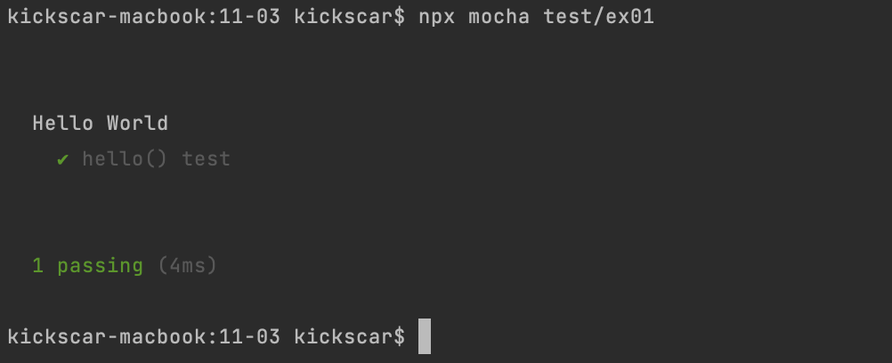
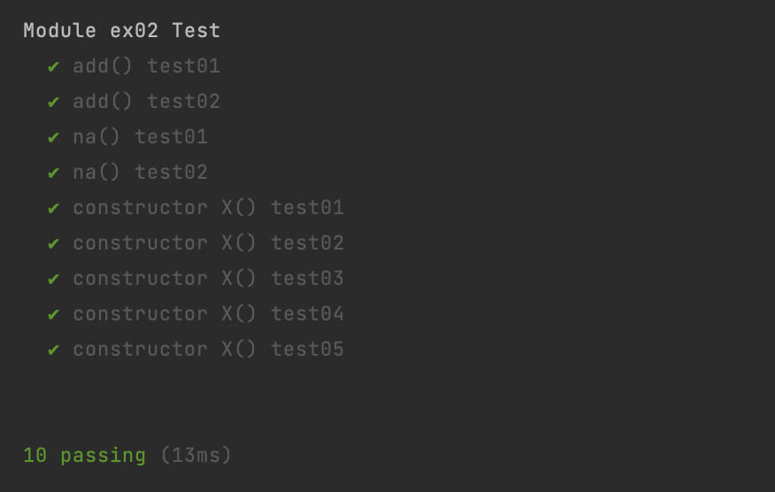

03. Mocha

## 자바스크립트 단위 테스트 도구
 애자일(Agile) eXtreme Programming의 TDD, BDD를 위한 단위 테스트가 소프트웨어 개발에 많이 적용되고 있다. 이를 도와주는 도구들이 거의 모든 언어별로 지원되고 있고 자바스크립트만 하더라도 스무 여가지가 된다. Java 진영에 JUnit이라는 대표적 단위 테스트 도구가 있듯이 자바스크립트에는 JSUnit이라는 단위 테스트 도구가 있었지만 벌써부터 개발이 중지되어 있는 상태다. 2010년에 JSUnit 프로젝트를 이어받은 Jasmine이 발표되었고 꾸준히 사용되고 있다. 한편, 2008년에 발표된 DOM 조작 라이브러리 jQuery가 큰 인기를 끌면서 jQuery 기반 코드 테스트에 QUnit이 많이 활용되었고 현재에도 jQuery 기반 비동기 코드 테스트에 많이 활용된다. 2009년에는 Node가 발표되었고 자바스크립트 기반 백엔드 개발에 활용되기 시작하였다. 따라서 Node 모듈 테스트를 위한 도구가 필요해졌고 2012년에 Mocha가 다른 테스트 도구에 비해 비교적 늦게 발표되었다. 
 
 정리하면, 현재 인기가 있는 JavaScript 단위 테스트 도구는 QUnit, Mocha, Jasmine 이렇게 세 가지 정도로 요약할 수 있다. 세 가지 도구들이 각각의 장점들이 있으며 개발자나 팀 그리고 프로젝트 특성에 맞게 선택되고 활용되는 것 같다. 그리고 그 선택 기준도 비교적 분명하다.
 
 보통, Node 기반 서버 개발이나 컴파일을 해야하는 JavaScript 애플리케이션 개발이 아닌 브라우저 DOM조작 애플리케이션을 jQuery 기반으로 작성하는 경우가 있다. 이 때에는 세팅이 비교적 쉽고 간단한 QUnit를 사용한다. QUnit은 jQuery 라이브러리 테스트를 위해 jQuery 개발자 존레식(John Resig)에 의해 개발되었고 jQuery 기반 코드 테스트에 많이 쓰인다. 최근의 자바스크립트 프론트엔드 애플리케이션 개발을 보면, 느린 브라우저의 직접적인 DOM 조작보다는 라이브러리(React와 같은)가 지원하는 가상 DOM 조작 API를 활용하는 방식으로 많이 작성된다. 이런 방식이 점점 인기를 끌면서 현재에는 QUnit은 인기는 많이 떨어져 있는 상태다.

 Node 기반 백엔드 개발이나 그리고 방금 언급한 형태의 자바스크립트 애플리케이션 개발에는 Jasmine과 Mocha를 고려하는 편이다. 세 가지 테스트 도구들은 당연 비동기 코드 테스트를 지원하지만 Mocha는 Promise를 지원하기 때문에 아무래도 비동기 테스트에는 Mocha를 우선 선택하게 된다. 참고로 QUnit도 Promise를 지원한다.

 테스트 도구에서 assertion 표현이 풍부하면 여러모로 장점이 많다. Jasmine은 자체적으로 assertion 라이브러리를 내장하고 있지만 Mocha는 없다. 대신에 Mocha는 Node에 내장된 assertion 모듈을 사용할 수 있고 chai, should.js, expect.js와 같은 외부 assertion 라이브러리들도 사용할 수 있는 유연함과 확장성을 가지고 있다. 하지만, 세팅과 학습에 다소 부담이 있는 것도 사실이다. 최근(2020년 기준)에는 Mocha가 Jasmine의 인기를 크게 앞질렀다. 두 도구는 테스트 함수와 문법이 서로 유사하기도 하지만 ES6 사용과 지원이 보편화 되면서 비동기의 Promise을 지원하는 Mocha가 우선 선택되는 것 같다. 개발자들에게 학습 부담이 유연함과 확장성을 포기할 만큼의 영향을 주지는 못하는 것 같다.

 정리한다. 여러 테스트 도구에서 굳이 하나를 골라 추천한다면 개인적으로 당연 Mocha 이지만 사실, 여러 테스트 도구들이 사용에 유사성이 상당히 많고 Test Runner로는 모두 [Karma](https://github.com/karma-runner/karma)를 사용하고 있다. 따라서 크게 고민없이 셋 중에 어떤 것이라도 골라 사용한다면 다른 테스트 도구로 전환하는 데 큰 어려움이 없을 것이다. React로 화면을 개발하고 있다면 React에서 지원해주는 Jest기반의 테스트 프레임워크를 쓰는 것이 좋다. Jest는 페이스북이 React 라이브러리 개발의 테스트를 위해 개발되었다. jQuery를 기반하고 있는 코드는 QUnit이 좋을 것이다. Node 기반 개발에서는 Mocha와 Jasmine을 선택 할 수 있는데, BDD 개발 방식의 표준 테스팅 [RSpec](http://www.betterspecs.org/ko/)에 맞는 테스트 코드 작성이 필요하면 Jasmine 이다. 반면, Promise 기반의 비동기 코드 테스트를 쉽게 하고 싶다면 Mocha 다.   
 

## Mocha 설치
 npm 모듈로 설치한다. moch는 운영서버에 배포된 애플리케이션에 포함되어 함께 실행되는 모듈이 아니다. 개발과정과 배포에 사용되는 모듈이기 때문에 -D(개발 의존성) 옵션으로 설치한다. 설치 후에는 npx로 Mocha를 실행할 수 있으며 --version 옵션을 함께 사용해 버전 정보와 설치를 확인할 수 있다. 

```bash
$ npm i -D mocha
$ npx mocha --version
8.0.1 
```

## 테스트 케이스 작성하기
 Mocha를 사용한 기본적인 테스트 케이스를 작성해 보자. 우선, 테스트 대상 모듈을 작성한다.

[ex01.js]
```javascript
exports.hello = () => 'Hello World';
```
 Mocha는 ES6 모듈 시스템을 당연히 지원하지만 예제에서는 프로젝트 타입을 바꿔야 하는(간단하지만) 번거로움이 있기 때문에 ES6 모듈 시스템 지원이 아닌 이전 CommonJS 방식의 모듈로 작성하였다. ex01.js 모듈의 hello() 함수를 테스트하는 테스트 케이스 모듈을 작성해 보자. 

[test/ex01.js]
```javascript
const assert = require('assert');
const { hello } = require('../ex01');

describe('Hello World', function() {
    it('hello() test', function() {
        assert.strictEqual(hello(), "Hello World");
    });
});
```
 'Hello World'라는 이름의 테스트 케이스는 'describe' 키워드를 사용해서 위의 코드처럼 작성한다. 테스트 케이스별로 테스트 콜백 함수를 작성하기 위해서는 'it' 키워드를 사용한다. assertion 라이브러리는 외부 라이브러리를 쓰지 않고 Node 코어 모듈인 assert 모듈을 사용했다. 주의 할 것은 테스트 케이스가 작성된 모듈(js 파일)은 Mocha에 의해 실행된다. 따라서 Node로 실행 시키면 당연히 오류가 발생한다. 이제 테스트 해보자.

```bash
$ npx mocha test/ex01
```



테스트가 통과됐다. 별다른 설명 없이 테스트 케이스 모듈을 'test' 디렉토리에 작성했는데 대부분 테스트 도구들도 그렇지만 Mocha도 특정 테스트 케이스 모듈 지정없이 실행되면 자동으로 'test' 디렉토리 안의 모든 모듈을 테스트 케이스로 간주하고 일괄 테스트를 진행할 수 있다. 따라서 테스트 케이스 모듈은 보통 프로젝트 디렉토리 아래 'test' 디렉토리에 작성한다. 그러면 모듈 지정없이 Mocha를 실행 해보자.

```bash
$ npx mocha
```

테스트 케이스 모듈을 지정했을 때와 같은 결과의 테스트가 수행되었을 것이다. package.json의 scripts에 'test' 스테이지(stage)로 추가하면 실행과 프로젝트 관리 자동화에 도움이 된다.

[package.json]
```json
    .
    .
    "scripts": {
        "test": "npx mocha"
    },
    .
    .
```

test 스테이지를 실행해 보자. 스크립트는 npm으로 실행한다.
```bash
$ npm test
```


## Assertion 기본
 테스트 케이스에서 수행되는 테스트 결과를 판별하기 위해 테스트 통과 조건과 테스트 대상 코드를 명시해야 한다. 이를 위해 assertion 함수를 사용한다. Mocha로 테스트 케이스를 작성하고 테스트 할 때는 보통 외부 assertion 라이브러리를 사용하지만 기초적인 assertion 연습을 위해 Node의 assert 모듈만 사용해 보자.
 
[ex02.js]
```javascript
exports.add = (x, y) => x + y;
exports.na = () => [1, 2, 3];
exports.X = function(){};
```

 테스트 할 간단한 모듈을 작성하였다. number 타입의 두 파라미터의 + 연산 결과를 반환하는 add() 함수, 배열을 반환하는 na() 함수 그리고 객체를 생성할 때 사용할 constcutor(생성자) 함수 이렇게 세 개의 간단한 함수를 작성하였다. assertion만을 살펴 볼 것이기 때문에 테스트 코드는 Mocha를 사용하지 않고 assert 모듈만을 사용한 평범한 자바스크립트로 작성하였다.

[ex02.test01.js]
```javascript
const assert = require('assert');
const { add } = require('./ex02');

try {
    assert.equal(add(10, 20), '30');
    assert.strictEqual(add(10, 20), '30');
} catch(error) {
    console.log(error.message);
}
```
 try-catch 구문을 사용해서 테스트 코드를 작성한 것을 볼 수 있다. assert 함수는 테스트 통과 조건을 만족하지 못하면 Error 객체를 던진다. Mocha의 테스트 케이스 내의 it 함수는 테스트 수행 콜백 함수를 try-catch로 랩핑하고 있을 것이라 짐작할 수 있다. Node assert 모듈로 assertion을 할 때는 Legacy Mode와 Strict Mode를 구분해야 한다. Strict Mode로 테스트가 이루어져야 하는 것이 당연해 보인다. 왜냐하면 Legacy 모드로 테스트하면 문제가 발생할 수 있는 코드가 의도한 assert 가 되지 않을 가능성이 있기 때문이다.
 
 예제를 보면, strictEqual은 30 === '30', equal은 30 == '30' 비교를 하는 것을 알 수 있다. === 연산자는 기본 타입에서는 타입과 값의 동일성(Equality)을 비교하고 객체에서는 객체의 동일성을 비교한다. 기본 타입의 값의 동일성 비교를 한다면 Strict Mode 테스트가 혼동을 피할 수 있다. 그래서 다음 4개의 Legacy Mode의 assert 함수들은 deprecated 되어 있다. 참고로 객체에서는 strictEqual은 두 객체의 동일성 비교를 한다. 객체의 구조 비교 즉, 동질성(Equantity)은 strictDeepEqual을 사용한다.

1.	equal(deprecated) -> strictEqual
2.	notEqual(deprecated) -> notStrictEqual
3.	deepEqual(deprecated) -> strictDeepEqual
4.	notDeepEqual(deprecated) -> notStrictDeepEqual

strict prefix가 붙은 함수를 쓰는 것이 귀챦고 안전하게 strict를 보장받는 방법으로 다음 코드를 참고한다.

[ex02.test02.js]
```javascript
const assert = require('assert').strict;
const { add } = require('./ex02');

try {
    assert.equal(add(10, 20), '30');
} catch(error) {
    console.log(error.message);
}
```
 assert.strict.equal은 assert.strictEqual의 alias 이다. 따라서 이 예제에서도 error가 던져 질 것이다. 다음은 equals과 deepEqual의 차이점을 살펴보자. 

[ex02.test03.js]
```javascript
const assert = require('assert').strict;
const { na } = require('./ex02');

try {
    assert.deepEqual(na(), [1, 2, 3], 'deepEqual: fail');
    assert.equal(na(), [1, 2, 3], 'equal: fail');
} catch (error) {
    console.log(error.message);
}
```
 assertion 함수에 실패 메세지를 함께 넘겨주면 테스트 실패 시 catch 에서 Error 객체의 message로 받을 수 있다. 이 예제의 결과를 살펴보면 eqaul이 실패한다. 즉, 두 배열 객체가 다른 객체이기 때문이다. 하지만 deepEqual은 성공한다. 두 배열 객체의 내용을 비교하기 때문이다. 다음 예제도 살펴보자.
 
[ex02.test04.js]
```javascript
const assert = require('assert').strict;
const { na } = require('./ex02');

try {
	const a = new X();
	const c = a;
	const b = new X();
   
	assert.equal(a, c,'a === c : fail');
	// assert.equal(a, b,'a === b : fail');
	assert.deepEqual(a, c, 'deepEqual1: fail');
	assert.deepEqual(a, b, 'deepEqual2: fail');
   
	b.bar = 'foo';
	assert.deepEqual(a, b, 'deepEqual3: fail');
} catch (error) {
	console.log(error.message);
}
```
 결과를 보면, a === b 두 객체의 동일성 비교하는 equal이 실패하고 bar 프로퍼티 추가된 b와 a의 deepEqual 결과가 실패한다. 그리고 지금 까지의 try~catch 문과 assert 만을 사용한 테스트 코드는 실패하면 Error가 발생하여 실패 코드 다음의 테스트 코드가 실행되지 않는 문제점이 있다. 주석을 활용하면 되지만 불편하고 테스트 자동화도 어렵다. Mocha와 같은 테스트 도구를 사용하게 되면 테스트 케이스의 테스트 함수들이 병렬로 테스트를 수행하기 때문에 이 문제를 해결할 수 있다. 지금 까지의 모든 테스트 코드를 Mocha을 사용한 테스트 코드로 변경하였다.

[test/ex02.js]
```javascript
const assert = require('assert').strict;
const { add, na, X  } = require('../ex02.js');

describe('Module ex02 Test', function() {

    it('add() test01', function() {
		assert.equal(add(10, 20), 30, 'equal: fail');
	});

    it('add() test02', function() {
		assert.notEqual(add(10, 20), '30', 'notEqual: fail');
	});

    it('na() test01', function() {
		assert.deepEqual(na(), [1, 2, 3], 'deepEqual: fail');
	});

    it('na() test02', function() {
		assert.notEqual(na(), [1, 2, 3], 'notEqual: fail');
	});

    it('constructor X() test01', function() {
        const a = new X();
        const c = a;
        assert.equal(a, c,'a === c : fail');
    });

    it('constructor X() test02', function() {
        const a = new X();
        const b = new X();
        assert.notEqual(a, b, 'a !== b : fail');
    });

    it('constructor X() test03', function() {
        const a = new X();
        const c = a;
        assert.deepEqual(a, c, 'deepEqual: fail');
    });

    it('constructor X() test04', function() {
        const a = new X();
        const b = new X();
        assert.deepEqual(a, b, 'deepEqual: fail');
    });

    it('constructor X() test05', function() {
        const a = new X();
        const b = new X();
        b.bar = 'foo';
        assert.notDeepEqual(a, b, 'notDeepEqual: fail');
    });
});
```
 테스트 결과이다. 다음 부터는 Mocha 테스트 케이스를 작성해서 활용하기로 한다.




## Assertion 외부 라이브러리 활용: chai 	
## Assertion 외부 라이브러리 활용: should.js
## 비동기 코드 테스트
## Hook 


