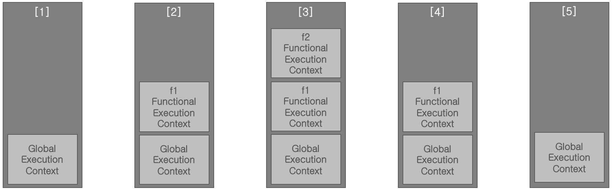

05.코드의 실행

 코드가 실행되면 자바스크립트 엔진 내부에는 어떤 일이 벌어진다. 자바스크립트 코드는 엔진에 내려진 명령이고 엔진이 그 코드를 실행하면 엔진 내부에 어떤 변화가 생길 것이다. 예를 들면 '어떤 값을 저장하는 변수를 생성하라', '사칙연산을 하라' 또는 '사칙연산 결과를 어떤 변수에 저장하라', '함수 객체를 생성하라', 'f라는 이름으로 참조하는 함수 객체의 코드블록을 실행하라' 등등 엔진이 실행하는 명령(실행 코드)은 셀 수 없을 정도로 다양하고 많다. 앞에서 이런 명령들을 자바스크립트 엔진의 실행 단위인 구문이라 하였다.

자바스크립트 엔진은 구문들을 실행하고 결과를 지속적으로 유지해야 할 책임이 있다. 이를 위해 자바스크립트 엔진은 내부에 코드실행을 위한 환경(Environment)인 '실행컨텍스트(Execution Context)'을 지속적으로 생성하고 관리한다. 실행컨텍스트는 Scope, Hoisting, this, Closure등의 동작 원리이며 자바스크립트의 내부를 이해하기 위한 중요 개념이다.

## 실행컨텍스트(Execution Context)

ECMAScript 표준에서는 실행컨텍스트의 생성 시기, 관리 정보(변수, 변수의 유효범위, this 바인딩, 함수선언) 그리고 그 정보들의 업데이트 시기 등을 상세하고 있는데 실행컨텍스트 생성과 구체적 작동 등과 같은 구현은 자바스크립트 엔진이 해야한다.

##### 2\. 실행컨텍스트의 생성

1.  실행 가능한 코드
    실행컨텍스트는 코드의 실행환경 정보를 저장하고 관리하기 위한 것이기 때문에 코드의 실행과 실행컨텍스의 생성은 연관성이 있다. 먼저 코드의 위치에 따라 실행 가능한 자바스크립트 코드를 구분해 보면,
    
    - 함수 내부에 존재하는 코드(함수 코드)
    - 함수 외부에 존재하는 코드(전역 코드)
    
    이 간단한 구분으로 실행컨텍스트의 종류와 생성 시기가 달라진다.
    
2.  실행컨텍스트의 구분    
    - 전역실행컨텍스(Global Execution Context)        
        - 함수 외부 코드의 실행 환경을 담고 있는 실행컨텍스트이다.
        - 자바스크립트로 작성된 애플리케이션이 실행되면 반드시 생성되는 기본(default) 실행컨텍스트이다.
        - 자바스크립트 코드가 최초로 실행될 때 생성되고 애플리케이션이 종료될 때까지 유지된다.
        - 자바스크립트 코드가 실행되는 동안에 하나만 존재한다.
        - 전역변수, 전역객체(global object, 브라우저에서만) 함수정의 등의 정보를 관리한다.

    - 함수실행컨텍스트(Functional Execution Context)
        
        - 함수 내부 코드의 실행 환경을 담고 있는 실행컨텍스트이다.
        - 함수마다 자신의 실행컨텍스트가 있으나 함수가 호출될 때 생성되고 함수 블록이 끝나면 사라진다.
        - 함수가 호출될 때마다 생성되기 때문에 개수가 많다.
        - 지역변수, 함수정의 등의 정보를 관리한다.

#### 3\. 실행컨텍스트의 관리

1.  실행컨텍스트 스택(Execution Context Stack)
    자바스크립트 엔진은 실행컨텍스트들을 실행컨텍스트 스택(Execution Context Stack)이라 부르는 스택에 넣어 관리한다. 특정 시점의 실행 코드의 결과는 스택의 탑에 있는 실행컨텍스트에 반영된다. 스택의 맨 아래에는 전역실행컨텍스트가 항상 위치하게 되고 함수실행컨텍스트는 함수가 호출될 때 푸시(push)되고 함수가 종료되면 팝오프(pop off)된다.
    
2.  실행컨텍스트 스택의 상태 변화
    최초 자바스크립트 코드를 실행할 때 전역실행컨텍스트를 스택에 푸시(push)하고 전역 범위의 구문들을 실행하면서 스택의 탑에 있는 전역실행켄텍스트에 그 실행 결과를 반영한다. 그러다가 함수 호출을 만나게 되면 함수실행컨텍스트를 새로 생성해서 스택에 푸시한다. 그 함수의 코드들의 실행결과는 스택의 탑(Top)에 있는 함수 실행컨텍스트에 반영된다. 함수 블록이 끝나면 스택의 탑에 있는 함수실행컨텍스트는 팝오프(pop off)되어 스택에서 사라지고 다시 탑에 있는 전역실행컨텍스트에 전역 범위의 구문들의 실행결과가 반영된다. 예제 코드와 그림으로 이 과정을 다시 이해해 보자.
    
    \[예제: ex01\]
    
    ```javascript
    console.log('Global EC pushed');
    
    function f1() {
       console.log("f1 Functional EC pushed");
    
       function f2() {
          console.log("f2 Functional EC pushed");
          // some codes...
          console.log('f2 Functional EC popped off');
       }
     
       f2();
       console.log('f1 Functional EC popped off');
    }
    
    f1();
    console.log('Global EC popped off');
    ```
    
    
    
    - \[1\] 예제 자바스크립트 코드의 1번 라인이 실행되기 전 전역실행컨텍스트가 생성되고 스택에 push 된다.
    - \[2\] 함수 정의 구문들의 반영은 스택의 탑에 있는 전역실행컨텍스트에 반영 될 것이다. 그리고 18번 라인의 함수호출 표현식구문이 실행되면 함수실행컨텍스트가 생성되고 스택에 push 된다.
    - \[3\] f1함수 블록 내에 f2함수 정의 구문의 실행 결과는 f1 함수 실행컨텍스트에 반영되고 12번 라인의 함수호출 표현식구문이 실행되면 함수실행컨텍스트가 하나 더 생성되고 스택에 push 된다.
    - \[4\] f2함수의 실행이 끝나면 f2함수와 관련이 있는 함수실행컨텍스트는 스택에서 pop 되면서 사라진다.
    - \[5\] f1함수의 실행이 끝나면 f1함수와 관련이 있는 함수실행컨텍스트도 스택에서 pop 되면서 사라진다.

#### 4\. 실행컨텍스트 생성과정 및 관리 정보

1.  생성 과정
    실행컨텍스트는 다음 두 단계를 거치면서 생성된다.
    
    1.  생성 단계(Creation Phase)
        
        - 실행컨텍스트 내에 코드 실행을 위한 환경 정보를 담는 컴포넌트를 생성한다.
        - 환경 정보는 어휘환경(Lexical Environment) 그리고 변수환경(Variable Environment) 정보로 각각 나눈다.
        - 따라서 어휘 환경 정보와 변수 환경 정보를 각각 저장하는 컴포넌트를 실행컨텍스트 내에 생성하는 단계다.
    2.  실행 단계(Execution Phase)
        
        - 코드가 실행되면서 그 결과를 생성 단계에서 생성한 두 개의 컴포넌트들에 반영(저장)하는 단계이다.
2.  어휘환경(Lexical Environment)
    다음 세 가지의 어휘환경 정보를 저장하고 관리하도록 서브 컴포넌트로 나누어서 구현되거나 하나의 컴포넌트로 구현될 수 있다.
    
    1.  환경기록(Environment Record)
        - 식별자와 객체(함수, 배열 포함) 레퍼런스 또는 기본 타입의 값의 매핑 자료구조를 구현한다.
        - 쉽게 말하면, 변수와 함수 정보를 저장하는 객체다.
    2.  외부 어휘환경 참조(Reference to The Outer Environment)
        - 이 참조를 통해 현재 실행컨텍스트의 어휘환경 내에서 변수를 찾지 못하면 외부에서 찾을 수 있게 한다.
    3.  this 바이딩(this Binding)
        - this 키워드의 참조를 결정하거나 세팅한다.
        - 예를 들어, 전역 실행컨텍스트에서 this 바인딩은 window 객체(브라우저)이고 함수 실행컨텍스트에서는 함수를 어떻게 호출했는 가에 따라서 바인딩을 결정해야 한다.
3.  변수환경(Variable Environment)
    변수환경은 어휘환경과 사실 동일하다. ES6부터 환경기록에서 차이점이 생겼다. 어휘환경 기록에는 함수 정보와 let과 const로 정의된 변수 정보가 저장돠고 변수환경 기록에는 var 키워드로 정의된 변수 정보만 저장된다.
    

#### 5\. 코드실행과 실행컨텍스트

앞에 설명한 내용은 ECMAScript 표준에서 상세하고 있는 실행컨텍스트 생성 과정의 요약이다. 실행컨텍스트 생성 과정에서 실행컨텍스트 내부에 저장되는 정보들을 알아보았고 그 정보들의 저장을 위한 컴포넌트들에 대해 추상적이고 개념적이면서 개괄적인 설명을 하였다. 지금부터 이 내용들의 실제 자바스크립트 엔진(v8) 구현을 자바스크립트 코드와 함께 살펴 볼 것이다.