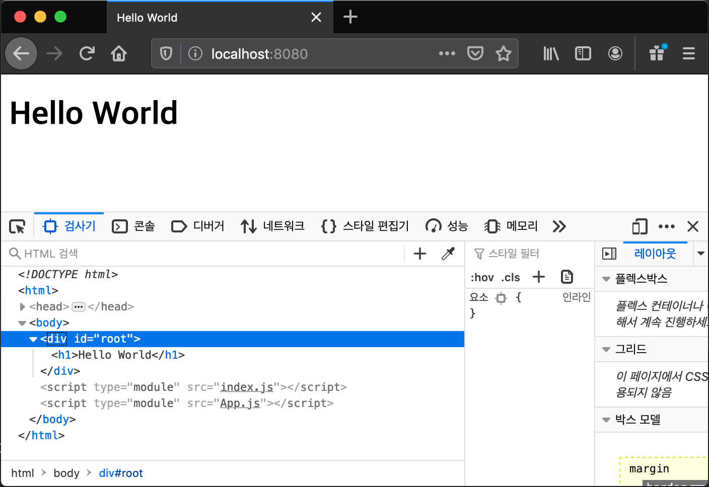

02. ES6 모듈 기반 애플리케이션

 ES6 모듈 시스템은 애플리케이션 개발시 하나의 파일에 집중되는 코드를 분리하여 개발 가능하게 해주기 때문에 코드 관리 문제를 해결할 수 있는 강력한 매커니즘을 제공해준다. 재사용 가능성이 있는 분리된 코드는 라이브러리화 하여 다른 애플리케이션 개발에 재사용 할 수도 있다. Node 기반의 백엔드와 프론트엔드 개발은 모듈 시스템이 필수이기 때문에 처음부터 CommonJS 기반 모듈 지원을 하고 있었지만 v14+ 부터 ES6 표준 모듈 지원으로 교체되었다. 뿐만 아니라 ES6 표준 모듈 시스템을 지원하는 브라우저가 점점 늘어나 현재는 대부분 브라우저가 지원하고 있다. 따라서 ES6 표준 모듈 시스템에 따라 의존성을 가지고 분리되어 있는 애플리케이션 모듈들의 개별적 브라우저 로딩도 완벽하게 보장해 준다.
 
 자바스크립트의 모듈은 js 파일 단위로 저장한다. 쉽게 말해, js파일 하나가 모듈이라 보면 된다. ES6 표준 모듈 시스템과 ES6 이전의 CommonJS 기반의 모듈 지원에서 모듈 내부의 함수, 클래스, 객체, 상수, 변수 등을 노출(Export) 하는 방법은 다르고 호환성도 없다. 다른 모듈에서 노츨된 모듈의 함수, 클래스, 객체, 상수 등을 사용하는 방법도 마찬가지다.   
 
 현재 자바스크립트 개발 생태계에서는 ES6 표준 모듈 시스템과 이전의 CommonJS 기반 모듈 지원이 혼재하여 사용되고 있는 다소 혼란스러운 상황이기 때문에 ES6 표쥰 모듈 시스템도 사용할 줄 알아야 하지만 ES6 이전의 모듈 지원도 이해하고 사용할 줄 알아야 한다.
 
## ES6 이전 모듈 지원
 우선, 간단한 애플리케이션을 단일 모듈로 작성해 보자. 

[예제: ex01/index01.js]
```JavaScript
const App = function(){
    const app = {};
    app.textContent = 'Hello World';

    return app;
};

console.log(App());
```  
1.	애플리케이션은 간단하다. App() 함수 안에서 app 객체를 생성해서 반환한다.
2.	생성되는 app 객체는 "Hello World" 문자열 값의 textContext 속성을 가지고 있다. 
3.	App() 함수를 호출해서 반환되는 객체를 console.log()로 출력한다.


다음 예제는 App() 함수를 정의하는 모듈과 App()함수를 사용하는 모듈로 각각 분리하는 예제이다.

[예제: ex01/app.js]
```JavaScript
const App = function(){
    const app = {};
    app.textContent = 'Hello World';

    return app;
};

module.exports = App;
```
1.	App 함수를 정의한다.
2.	module.exports를 통해 외부로 노출할 함수 객체를 지정했다.
3.	하나의 함수 객체뿐만 아니라 하나의 일반 객체 그리고 기본 타입의 값들도 외부로 노출이 가능하다.  

[예제: ex01/index02.js]
```JavaScript
const App = require('./app02.js');
console.log(App());
```
1.	require 함수를 사용하여 모듈에서 노출된 객체를 변수로 받아 사용한다.
2.	모듈의 확장자는 생략할 수 있다.

 require() 함수는 Node에서만 지원하는 동기 방식의 IO 함수다. 사용하는 모듈을 작성할 때 주의할 것은 모듈의 윗부분의 초기화 단계에서 일괄적으로 require() 함수를 사용하는 것이 바람직하다. require는 함수이기 때문에 로직이 실행되고 있는 코드에서 호출하는 것도 가능하다. 하지만, 동기 방식으로 작동하기 때문에 require() 함수가 완료될 때까지 코드가 멈춘다. 만일 서버 애플리케이션이라면 성능 저하를 가져올 수 있다. 이는 Node 프로그래밍에서 require를 비롯한 동기식 작업을 애플리케이션 초기화하는 단계에서 사용하는 일반적인 이유이기도 하다.
 
 다음은 다수의 값과 함수를 외부로 노출하는 모듈을 작성한다. 사실, 모듈 작성이 필요한 대부분 경우에는 module.exports 보다는 exports를 사용하는 방식만으로 충분하고 그렇게 하도록 디자인되어 있다. module.exports가 exports 보다는 모듈이 구조적으로 보이는 이유 때문에 다음 예제처럼 module.exports로 작성을 하는 경우도 있다. 하지만, module.exports를 사용하는 것은 require() 디자인 의도와 다르다는 것을 명확히 알고 사용하는 것이 필요하다.
 
[예제: ex02/math.js]
```JavaScript
module.exports = {
    PI: 3.14,
    max: function() {
        let max = Number.MIN_SAFE_INTEGER;
        Array.from(arguments).forEach(arg => max = arg > max ? arg : max);
        return max;  
    },
    min: min = function() {    
        let min = Number.MAX_SAFE_INTEGER;
        Array.from(arguments).forEach(arg => min = arg < min ? arg : min);
        return min;
    }
}
```
1.	number 값 PI와 min과 max 함수를 외부에 노출하는 모듈이다.
2.	하나의 객체에 노출할 값과 함수를 정의하였다.
3.	노출할 객체를 먼저 정의하고 module.exports에 대입해도 되지만 바로 module.exports에 노출 객체를 정의하는 방식으로 작성하였다.  

[예제: ex02/index.js]
```JavaScript
const math = require('./math01');

console.log(math.PI);
console.log(math.max(-20, -10, -1, 0, 1));
console.log(math.min(-20, -10, -1, 0, 10, 20));
```
1.	require 함수를 사용하여 모듈에서 노출된 객체를 변수로 받아 사용한다.
2.	받은 변수 이름으로 노출된 값과 함수의 이름으로 접근하면 된다.

 다음 ex03 예제는 ex02 예제와 완전 동일하지만 module.exports 대신에 export만 사용해서 작성했다.

[예제: ex03/math.js]
```JavaScript
exports.PI = 3.14;

exports.max = function() {
    let max = Number.MIN_SAFE_INTEGER;
    Array.from(arguments).forEach(arg => max = arg > max ? arg : max);
    return max;
}

exports.min = function() {
    let min = Number.MAX_SAFE_INTEGER;
    Array.from(arguments).forEach(arg => min = arg < min ? arg : min);
    return min;
}
```
1.	exports 객체에 속성 이름과 값 또는 함수 정의를 대입하는 방식이다.
2.	외부에서는 이 속성 이름으로 값 또는 함수에 접근하면 된다.

 ex03을 보면 exports로 객체를 생성하는 것처럼 보이지만 사실은 module.exports 객체를 exports라는 이름으로 접근하고 있는 코드다. 이를 이해하기 위해 다음 짧은 예시 코드를 살펴볼 필요가 있다. 처음 두 줄 코드가 먼저 실행되고 require() 함수의 아규먼트로 전달된 모듈의 코드가 실행된 후 module.exports를 반환한다.
 
```JavaScript
module.exports = {};
exports = module.exports;
.
.
.
return module.exports;
```

 간단한 처음 두 줄 코드에서 exports는 먼저 생성된 module.exports 객체의 별칭(alias)과 같다. 그리고 require() 함수는 항상 module.exports를 반환한다. ex03/math.js의 exports는 처음 생성된 module.exports 객체에 속성을 추가하는 역할을 한다. 이런 이유로 만일 다음의 예제들과 같이 모듈이 작성되어 있다면 작성 의도와 다른 값과 객체들이 반환되거나 반환되지 못할 것이다.

[예제: ex04/error_mod01.js]
```JavaScript
const App = function(){
    console.log('App() called');
}

exports = App;
```
1. App() 함수의 익스포트를 기대하지만 잘못된 사용이다.
2. require('./error_mod01') 가 반환하는 객체를 확인해보면 {}로 이 모듈이 외부로 익스포트하는 것은 아무 것도 없다.

[예제: ex04/error_mod02.js]
```JavaScript
module.exports = function(){
    console.log('function01');
}

exports.function02 = function(){
    console.log('function02');
}
``` 
1.	두 함수의 익스포트를 기대하지만 잘못된 사용이다.
2.  module.exports 객체를 {} 에서 함수로 바꿨다.
3.  따라서 바꾼 함수만 외부로 익스포트 될 것이다.
4.  require('./error_mod01')() 코드로 확인해 볼 수 있다.

[예제: ex04/error_mod03.js]
```JavaScript
module.exports = {
    n: 10,
    s: 'javascript module',
    o: {} 
}

exports.b = true;
exports.f = function(){
}
```
1. 앞의 error_mod02.js의 잘못된 사용과 같다.
2. 결과적으로 module.exports와 exports를 함께 사용하면 순서와 상관없이 exports는 무시된다.


----
(여기서 부터 다시 작성)

## ES6 표준 모듈 시스템
 먼저, Node V14+ 부터 공식 지원하는 ES6 모듈 시스템으로 모듈 프로그래밍을 하기 전에 알아야 할 것이 있다. ES6 모듈 시스템은 이전 CommonJS 기반의 모듈 지원과 호환성이 전혀 없다. "use strict"의 존재 유무와 상관없이 무조건 strict 모드다. 따라서 CommonJS 기반의 모둘 지원으로 작성된 모듈은 ES6 표준 모듈 시스템의 import로 불러 올수 없다. 반대로 ES6 표준 모듈 시스템의 export로 작성된 모듈도 require() 함수로 불러 올 수 없다. 
 
 그리고 ES6 모듈 시스템이 작동하기 위해서는 package.json의 type 속성이 'module'로 설정되어 있어야 한다. 보통 Node기반 개발 프로젝트의 디렉토리에는 프로젝트 매니페스트 파일(패키지 관리 파일)인 package.json 파일(npm init 명령으로 생성)이 존재한다. package.json 파일의 역할과 문제점에 대한 자세한 내용은 '11장 개발 환경'의 npm을 설명하면서 자세히 다룬다. 

#### 1. JavaScript 모듈 지원: project-ex01

##### 1-1. src/App.js module

```javascript
export const App = function(){
    const app = {};
    app.textContent = 'Hello World';

    return app;
};
```

 ES6 export 키워드를 통해 외부에 노출하는데, 노출 방법은 여러 객체를 노출하거나 하나의 객체를 노출하는 두 가지 방법으로 나눌 수 있다. 예제는 함수 하나만 export 하고 있지만 여러 객체를 노출하는 방법을 사용하고 있다. 

​	앞에서 웹 애플리케이션 분리로 App.js와 index.js 두 모듈을 작성했다. 이 예제는 ES6 모듈을 테스트 하는 Node 기반 애플리케이션으로 브라우저에서 동작하는 애플리케이션이 아니다. 그래서 DOM API를 사용하여 HTMLElement 객체를 생성하는 대신 Object 타입 객체 `{}` 생성으로 바꿨다.     

##### 1-2. src/index.js module

```javascript
import  { App } from './App.js';

console.log(App());
```

​	index.js 에서 외부 모듈 App.js 모듈이 노출한 객체를 참조하기(불러오기) 위해 import 키워드를 사용했다. App.js 모듈이 다수의 객체를 하나의 객체에 담아 노출하는 export 방식이기 때문에 import 에서는 `ES6 객체 분해` 문법을 사용해서 하나의 객체 안에 노출된 여러 객체 중 불러올 특정 객체들을  `{}` 안에 지정한다. App.js 에서 노출된 객체는 App 함수밖에 없기 때문에 예제 index.js의 import 구문에서는 `{}` 안에 App 함수만 지정했다.

##### 1-3. 실행 및 결과 확인

```bash
$ node src/index
{ textContent: 'Hello World' }
```

​	Node 백엔드 애플리케이션을 여러 모듈로 나누고 모듈에서 객체를 export하고 import하는 방법을 ES6 모듈 지원 방법으로 실습해 보았다. 이 예제는 동일한 호스트의 지정된 위치에 이미 해당 모듈이 존재하는 상태에서 동작하기 때문에 ES6 모듈을 작성하는 방법과 사용법만 살펴본 예제다.

​	하지만 백엔드가 아닌 프론트엔드 애플리케이션 모듈에서는 네트워크를 통한 개별 모듈들의 로딩 동기화를 고려해야 한다. ES6 모듈을 지원하는 브라우저는 모듈 로딩 동기화를 해결하고 보장해 주기때문에 신경 쓰지 않고 어떻게 애플리케이션을 모듈로 잘 분리하고 재사용 문제 즉, 설계 문제만 고민하면 된다. 예제 project-ex02에서 확인해 보자.         

#### 2. 브라우저 모듈 지원: project-ex02

##### 2.1 public/index.html

```html
<!DOCTYPE html>
<head>
	<meta charset='utf-8'>
	<title>Hello World</title>
</head>
<body>
    <div id='root'></div>
    <script type="module" src='index.js'></script>
    <script type="module" src='App.js'></script>
</body>
```

​	앞의 실습과 동일하게 index.js, App.js 두 js 파일(모듈)를 링크한다. 다른 것은 `type='module'` ES6 모듈 지원 설정이다. 백엔드 작성에서 package.json 설정의 `'type': 'moduel'` 과 유사하다. 브라우저가 모듈 의존성과 로딩 동기화를 테스트하기 위해 일부러 index.js 먼저 로딩하게 순서를 설정했다. 의존성을 무시한 단순한 JavaScript 파일 로딩이면 에러가 발생할 것이다.

##### 2.2 public/index.js

```JavaScript
import { App } from './App.js'
document
    .getElementById('root')
    .appendChild(App());
```

​	import 구문을 사용해서 App.js 모듈의 App 함수를 import 한다.

##### 2.3 public/App.js

```JavaScript
export const App = function(){
    const app = document.createElement('h1');
    app.textContent = 'Hello World';

    return app;
}
```

​	export 구문을 사용해서 App 함수를 외부로 노출한다.

##### 2.4 Express 서버 작성 및 실행

​	앞의 실습과 같다. 실습 프로젝트에서 복사하거나 앞의 실습의 'Express 서버 작성 및 실행' 부분을 참고하여 server.js 작성하고 실행하도록 한다.

```bash
$ node server
starts server on port 8080
```

​	브라우저로 접근해 보면 잘 작동하는 것을 확인할 수 있다.



#### 3. 결론

​	ES6 모듈 지원으로 백엔드 뿐만 아니라 프론트엔드 애플리케이션 개발에서도 모듈로 분리하여 개발이 가능하다는 것을 확인 하였다. 복잡한 프론트엔드 애플리케이션 개발도 원칙적으로 잘 정의된 모듈로 분리하여 개발이 가능하다.

​	하지만, 프론트엔드 애플리케이션이 수십에서 수백 개의 모듈로 분리될 경우, 브라우저에서 개별적으로 이 모듈들을 import하는 것은 상당히 비효율적이다. 뿐만 아니라 더 고려해 보아야 할 프로그래밍 모델 관점의 문제점도 있다. 프론트엔드 웹 애플리케이션은 JavaScript 이 외의 다양한 애셋(HTML, CSS, Image, Font)으로 구성되어 있기 때문에 JavaScript가 이 다양하고 많은 애셋들을 어떻게 다루어야 개발뿐만 아니라 실행시 로딩 동기화에 문제가 없는 가 하는 점이다. 

​	이 문제는 다양한 모든 애셋들을 JavaScript 모듈로 취급하는 추상화 작업과 하나의 js 파일(번들)로 묶어 브라우저에 전달하는 것으로 해결하고 있다. 하나로 묶은 번들의 사이즈가 커지는 것이 문제가 되지만 이는 코드 분할 및 지연로딩 방법으로 해결한다. 번들로 묶어 주는 도구로 grunt, gulp, webpack 등이 있고 특히, webpack은 모듈간의 의존성 분석을 통해 의존 관계의 모듈들만 하나의 번들로 만든다. 이런 특징으로 빌드 도구에서 큰 인기를 얻고 있다.  

​	webpack 모듈 의존성 기반 빌드(번들링)을 이용해 모듈로 잘 분리된 애플리케이션을 하나의 번들로 만들 수 있고 브라우저는 모듈 지원 여부와 상관 없이 이 번들만 다운로드 하면 된다. 최근 대규모 프론트엔드 애플리케이션 개발에는 webpack을 사용한 번들링이 필수처럼 되었다. 당연히 애플리케이션은 모듈로 잘 분리되어 개발되어 있어야 함을 전제로 한다. ES6 모듈 스펙을 이해하고 개발에 적용할 줄 알아야 하는 이유이다.

​	다음 실습에서는 webpack을 사용하여 모듈로 분리된 애플리케이션을 번들링하고 번들 파일을 브라우저에 전달해 애플리케이션을 실행해 볼 것이다.