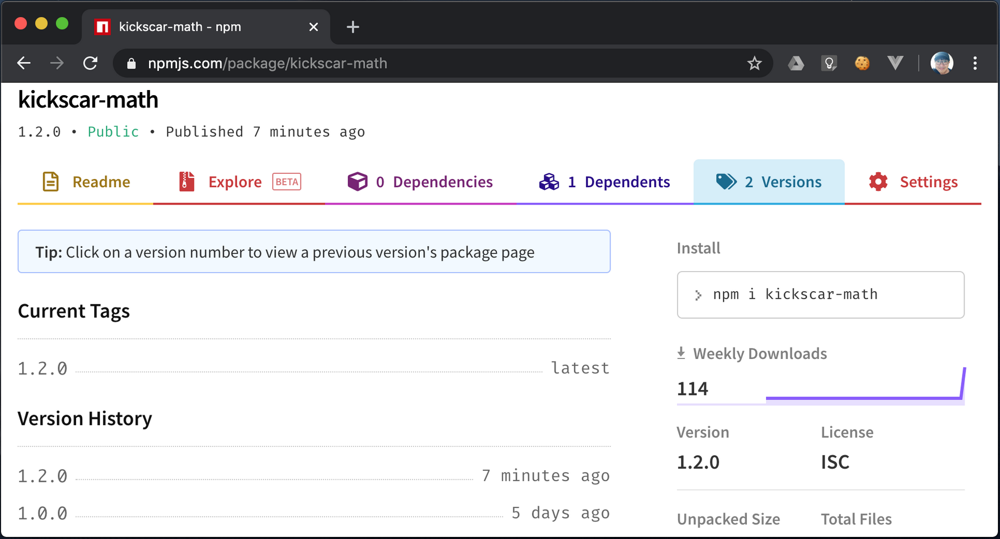

02. npm

## 패키지 관리

#### 3-1. 패키지

1. 완전한 애플리케이션, 코드 샘플, 프로젝트에서 사용하는 모듈 또는 라이브러리
2. npm은 이런 다양한 형태의 패키지들을 관리하는 도구이다.

#### 3-2. 의존성(Dependency)

1. 개발하고 있는 패키지의 프로젝트에 설치하고 사용하는 다른 패키지들을 의존성이라 한다.
2. 일반 의존성 : 개발 중인 프로젝트 패키지가 사용하고 있는 패키지들로 배포에 꼭 포함되어야 패키지들이다.
3. 개발 의존성 : 주로 개발에 필요하거나 도움이 되는 패키지들이다. 배포에 꼭 포함될 필요는 없다.

#### 3-3. 패키지 설치 방식

1. 전역(global) 설치 : 여러 개발에서 공통적으로 자주 사용되는 도구들을 설치한다.
2. 지역(local) 설치 : 특정 프로젝트에만 종속적인 패키지나 도구들을 설치한다.

#### 3-4. [실습]  패키지 설치하기

 1. 실습 프로젝트 디렉토리 project-ex01 만들기

	

 2. underscore 설치 해보기
	
	

    + 프로젝트 project-ex01에 package.json 파일이 없다는 경고와 패키지 구성요소가 빠져있다는 경고가 뜬다. 

    + 프로젝트의 배포를 위해서 package.json 파일이 필요하다. 

    + package.json의 용도는 프로젝트에 대한 이름, 버전, 설명, 작성자, 라이센스 등의 설명(metadata) 외에도 빌드와 배포를 위해 다른 패키지에 대한 의존성도 함께 기술한다. 이는 빌드 툴에 의해 빌딩과 패키징에 이용된다. 따라서 대부분의 자바스크립트 프로젝트에는 package.json이 있으며 꼭 생성하여야 한다.

    + package-lock.json 파일에 대한 notice가 뜨는 것을 볼 수 있다.

    + npm 5.x 버젼 부터 package.json의 의존성 관리 단점을 보완하기 위해 package.json과 별도로 package-lock.json이 자동으로 생성된다.

    + JavaScript 프로젝트에는  package.json와 package-lock.json이 동시에 존재하면서 의존성 관리를 하게된다. 하지만 다소 의존성 관리에 차이가 있고, 그 주된 목적도 차이가 있다. 자세한 설명은 4. 패키지 배포 에서 설명한다. 

    + node_modules 디렉토리가 생성된 것을 볼 수 있다. 지역(local)설치를 통해 설치되는 패키지는 이 디렉토리에 설치된다. 참고로 package-lock.json은 node_modules의 변화를 기록하는 스냅샷이라 볼 수 있다.

    + 특정버젼(v1.8.0)  설치 해보기
  
	
​          

 3. 프로젝트 의존성 초기화  : 초기화하는 방법은 단순하다. node_modules, package.json, package-lock. json 모두 삭제하면 된다.

    ```bash
    $ rm -rf node_modules
    $ rm -f package.json
    $ rm -f package-lock.json
    ```

    + 앞의 실습에서 package.json 파일은 생성하지 않았기 때문에 삭제 에러가 날 것이다.
    
    + 이제부터 모든 실습 프로젝트에는 반드시 `npm init` 으로 package.json 파일을 생성하도록 한다.
    
      **[주]** 설치한 패키지는 `npm un <패키지>` 로 제거할 수 있다. 처음에 package.json 파일을 생성하지 않았기 때문에 node_modules 디렉토리를 삭제했다.

 4. npm init 명령으로 package.json 파일 생성하기
	
	

    + 비교적 쉽게 만들 수 있다.
    + 프로젝트 설정에 필요한 몇 가지 질문을 하는데 엔터를 눌러 기본으로 설정한다.
    + 이 과정이 귀챦으면 `npm init -y`  처럼 `-y` 옵션을 사용하면 된다.

 5. 기본(no option) 또는 `--save` 옵션으로 로컬 설치하기

    + 옵션 없이 underscore.js 를 설치한다.

      ```bash
      $ npm i underscore
      ```

    + 설치 후, package.json의 내용을 확인해 보자.

      

    + 로컬 설치는 기본적으로 프로젝트의 node_modules에 패키지가 설치된다.

    + package.json에도 의존성이 반영되어 있다. 버젼을 보면 ^1.9.2 caret range 로 버젼이 기록되어 있다.

    + npm에서는 패키지 버젼을 표시하는 방법을 다양하게 지원하고 있다. (참고: [The semantic versioner for npm](https://docs.npmjs.com/misc/semver.html))

    + ^1.9.2 가 의미하는 것은 package.json을 기반으로 의존성 패키지 underscore.js 를 설치할 때, 설치 시점의 uderscore.js 1.9.2 이상 2.0.0 미만 업그레이드된 버젼만 설치하겠다는 의미다.

    + 약간 비딱하게 해석해 보면 "지금과 다른 버젼이 설치될 수 있단 뜻인가? 문제아냐?" 생각할 수 있다. 그렇다 다른 버젼이 설치될 수 있다. 대체적으로 문제가 될 가능성은 낮지만 간혹, 문제가 발생할 가능성은 있다. 이 문제에 대해서는 4. 패키지 배포에서 다룬다.

    + 자동으로 생성된 package-lock.json 내용을 보자.

      

    + 버전이 고정된 것을 확인 할 수 있다. npm은 두 개의 파일 중  package-lock.json 우선으로 설치하기 때문에 project-ex01 프로젝트에서 node_modules을 삭제하고 다시 설치하면 1.9.2 underscore 설치를 보장 할 수 있다. 

    + `--save` 옵션은 npm 5.x에서 deprecated 되었다. 기본 설치(no option)가 `--save`를 대체한다. 다시 말해 완전 동일하다. 

    + 이전 버젼에서는 `--save` 옵션을 달지 않으면 package.json에 반영하지 않고 node_modules 에만 설치 했었다.

    +  5.x+ 에서는 package.json의 애매한 의존성 관리를 보완한 package-lock.json이 생겨났고 혼동을 줄 우려 때문에 `--save` 옵션은 없어졌다. package.json을 무조건 업데이트 한다.

 6. -g 옵션으로 전역(global) 설치하기

    + 전역 설치는 개발머신에 한 번만 설치하고 모든 프로젝트에 별도의 로컬 설치없이 사용할 수 있다는 뜻이다.

    + 간혹, 리눅스 머신이나 mac 머신에서는 root 권한이 필요할 수도 있다.

    + 보통은 여러 개발에 필요한 빌드툴과 같은 공통 패키지를 주로 설치한다.

    + 앞으로 자주 사용하게 될  빌드툴 gulp를 전역으로 설치해 보자.

      ```bash
      $ npm i -g gulp
      ```

    + 설치 후, node_modules 내용을 확인해 보면 로컬 설치가 아니기 때문에 패키지가 없는 것을 확인할 수 있다. 그리고 gulp 버젼을 확인해 보면 설치가 잘 되었다.

      


 7. `--save-dev` 옵션의 용도
+ ㅇㅈㅇㅈ
  
+ ㅇㅈㅇㅉ


​          

### 4. 패키지 배포

#### 4-1. package.json과 package-lock.json

1. package.json은 이름대로 패키지에 대한 설명(기술)해 놓은 파일이다.(프로젝트에 대한 이름, 버전, 설명, 작성자, 라이센스 등의 프로젝트 메타데이터도 포함한다.)
2. package.json 의 어트리븃에 해당하는 각각의 항목에 대한 자세한 설명은 이 문서(https://docs.npmjs.com/files/package.json) 를 참조한다. (한글 번역도 많다)
3. package.json은 패키지 배포를 주목적으로 한다. 그러므로 배포할 패키지에는 반드시 있어야 한다.
4. 배포되어 설치되는 패키지는 다른 패키지에 의존성을 가지고 있는 경우가 대부분이다. 따라서 다른 패키지에 대한 의존성을 package.json에 기술해야 한다.
5. package.json은 프로젝트 빌드 시, 빌드툴이 의존성 체크에 사용하고 패키징에도 사용된다. 
6. 반면, package-lock.json은 의존성 관리만을 주목적으로 한다. 개발하는 동안의 node_modules 디렉토리와 package.json의 변화를 반영한다. 프로젝트에서 현재 사용하고 있는 의존성 패키지의 버젼을 고정시킨다.
7. package-lock.json은 개발이 진행 중일 때의 의존성 관리(특정 시점의 의존성 고정)가 주목적이고 배포와 빌드에는 관여하지 않는 것이 package.json와 다른점이라 볼 수 있다.
8. 따라서, 협업을 통해 개발이 진행된다면 package-lock.json을 형상관리에 반드시 포함해야 한다.
9. package.json은 package-lock.json과 의존성 기술에 다소 차이가 있기 때문에 차이점에 대해 이해해야 한다.
10. 프로젝트에는 두 파일이 함께 존재한다. 의존성 변경이 발생하면  두 파일 모두에 동시에 반영된다. 
11. `npm i` (npm install) 은 package-lock.json의 의존성을 우선하고 package-lock.json이 존재하지 않으면 package.json을 참고해서 패키지 설치를 한다.
12. 다음 실습에서는 JavaScript 모듈 패키지를 작성해보고 배포를 위해 package.json를 작성한다. 그리고 다른 프로젝트에서 이 모듈 패키지를 설치하고 사용해 본다.

#### 4-2. [실습 ] 패키지 작성과 설치 : kickscar-math 모듈 패키지 작성하고 설치 및 사용하기

 1. 패키지 kickscar-math 프로젝트 디렉토리 만들기

	

 2. kickscar-math.js 작성

    ```javascript
    exports.sum = function(){
    	let sum = 0;
    	Array.from(arguments).forEach(arg => {
    		sum += arg;
    	});
    	return sum;
    }
    
    exports.max = function(){
    	let max = Number.MIN_SAFE_INTEGER;
    	Array.from(arguments).forEach(arg => {
    		if(arg > max){
    			max = arg;
    		}
    	});
    	return max;
    }
    
    exports.min = function(){
    	let min = Number.MAX_SAFE_INTEGER;
    	Array.from(arguments).forEach(arg => {
    		if(arg < min){
    			min = arg;
    		}
    	});
    	return min;
    }
    ```

    + 간단한 sum(...), max(...), min(...) 함수가 작성된 모듈이다.
    + ES2015(ES6) 문법으로 작성되었다.
    + 간단한 애플리케이션 app-ex01.js를 작성해서 이 모듈의 함수들을 테스트해보자

 3. 테스트 애플리케이션을 작성할 프로젝트 project-ex02 디렉토리 만들기
	
	

 4. 테스트 애플리케이션 app-ex01.js 작성 : 파일 모듈 테스트

    ```javascript
    const kickscarMath = require('../kickscar-math/kickscar-math');
    
    console.log(kickscarMath.sum(10, 20, 30, 40, 50));
    console.log(kickscarMath.max(-10, -20, -30));
    console.log(kickscarMath.min(-30, -20, -10, 0, 10, 20, 30));
    ```

    + 모듈은 **코어 모듈**, **파일 모듈**, **npm 모듈** 세 가지 가 있다. 코어 모듈은 fs, os처럼 node에서 제공하는 모듈이다. 파일 모듈은 위의 예제처럼 모듈 파일의 경로로 불러와서 모듈의 객체나 함수를 사용한다. npm 모듈은 npm을 통해 node_module에 설치되는 모듈을 일컫는다.

    + 실행 결과
	  
      

 5. 테스트 애플리케이션 app-ex02.js 작성 : npm 모듈 테스트

    ```javascript
    const kickscarMath = require('kickscar-math');
    
    console.log(kickscarMath.sum(10, 20, 30, 40, 50));
    console.log(kickscarMath.max(-10, -20, -30));
    console.log(kickscarMath.min(-30, -20, -10, 0, 10, 20, 30));
    ```

    + npm을 통해 node_modules 디렉토리에 설치된 패키지(모듈)를 사용할 때는 코어 모듈처럼 경로대신 이름만 적어주면 된다.
    + 지금은 kickscar-math 모듈을 설치하지 않았기 때문에 MODULE_NOT_FOUND 에러가 발생한다.
    + npm을 사용해서 package.json 생성해서 kickscar-math 모듈을 배포 패키지로 만들고 이 패키지를 설치해서 app-ex02.js가 정상적으로 작동 되도록 한다.

 6. kickscar-math 모듈 패키지 배포 : 로컬 배포

    + kickscar-math 프로젝트 디렉토리로 이동

    + package.json 파일 생성하기

	  

    + 이제 project-ex02 디렉토리에서 kickscar-math 모듈 패키지를 npm으로 설치 해보자.
	  	  
	  

    + node_modules 디렉토리의 내용을 확인해보자 
	  	  
	  

    + app-ex02.js 를 실행해보자.
	  	  
	  

    + npm 설치와 함께 생성된 package-lock.json 내용을 확인해보자.
	  
	  

#### 4-3. npm registry에 원격 배포하고 설치하기

1. NPM(www.npmjs.com) 에 계정이 있다면 자신의 패키지를 원격 배포할 수 있다.
2. 로컬 배포와 설치가 잘되었다면, npm 레지스트리에 원격 배포는 쉽다.
3. 보통, 자바스크립트 패키지들은 이 방법으로 배포와 설치되고 있다. 그렇게 어렵지 않기 때문에 간단히 실습을 통해 알아본다.

#### 4-4. [실습] kickscar-math 모듈 패키지를 npm registry에 원격 배포하기

 1. 이미 package.json을 작성해 놓은 kickscar-math를 자신의 npm 계정에 배포한다.(주의: 패키지 이름은 자신의 npm 계정뿐만 아니라 npm 전체에서 유일해야 한다.)

 2. 가능하면 git에 패키지 소스를 올려 npm 배포 패키지와 함께 소스도 관리하도록 하자(실습에서는 생략)

 3. npm계정 정보 입력
	
	

    + 먼저 NPM(www.npmjs.com)에 계정 등록(가입)을 해야한다.
    + npm adduser 명령으로 npm 자신의 계정에 로그인 하자.

 4. 모듈 패키지 kickscar-math 업로드 하기
	
	

 5. npm 계정에서 패키지 업로드 확인하기

	

 6. 테스트 애플리케이션을 작성할 프로젝트 project-ex03 디렉토리 생성
		
	

 7. 테스트 애플리케이션 app-ex01.js 작성

    ```javascript
    const kickscarMath = require('kickscar-math');
    
    console.log(kickscarMath.sum(10, 20, 30, 40, 50));
    console.log(kickscarMath.max(-10, -20, -30));
    console.log(kickscarMath.min(-30, -20, -10, 0, 10, 20, 30));
    ```

    + 앞의 npm 모듈 테스트 애플리케이션 코드와 같다.

    + 차이점은 패키지를 로컬 패키지 디렉토리가 아니라 npm 레지스트리에서 다운로드해서 설치한다는 점이다.

    + 지금은 프로젝트에 kickscar-math를 설치하지 않았기 때문에 에러가 발생한다.

 8. kickscar-math 모듈 패키지 설치하기
	
	

    + `npm install kickscar-math` 패키지 이름만으로 다운로드해서 설치된다.

    + node_modules 디렉토리를 확인해보자.

 9. 테스트 애플리케이션 app-ex01.js 실행하기
	
	

#### 4-5. [실습] package.json 의존성 관리의 문제점 : 준비작업

 1. 문제점을 테스트 하기위해 kickscar-math 패키지에 의존성을 가지는 kickscar-calculate 모듈 패키지를 npm 레지스트리에 등록 하였다.
	
	

 2. kickscar-calculate 모듈 코드는 비교적 간단하다. kickscar-calculator.js에 run(functionName, numbers) 함수를 작성해서 export한다.

    ```javascript
    const kickscarMath = require('kickscar-math');
    
    exports.run = function(functionName, numbers){
        return kickscarMath[functionName] && kickscarMath[functionName].apply(this, numbers);
    }
    ```

    + kickcar-math 에 있는 함수이름과 계산할 값을 배열로 넘겨받아 해당 이름의 kickscar-math 모듈의 함수를 실행한다.

    + 약간 복잡해 보이는 것은 가변 arguments를 넘겨야 하기 때문에 apply를 사용한 정도인데, 중요한 것은 의존성이  여러 단계로 복잡해졌을 때, package.json의 문제점을 살펴보는 것이기 때문에 코드 설명은 이 정도로 한다.


#### 4-6. [실습] package.json 의존성 관리의 문제점 : 의존성 패키지가 업그레이드(패치) 되는 경우

 1. kickscar-calculator 패키지를 사용하는 애플리케이션 project-ex04를 개발할 때, kickscar-calculate가 업그레이드(패치)된 경우다.

 2. project-ex04 프로젝트에 app-ex01.js를 작성하였다.

    ```javascript
    const calculator = require('kickscar-calculate');
    
    const tokens = process.argv.slice(2);
    const result = calculator.run(tokens[0], tokens.slice(1).map(function(s){ 
        return parseInt(s, 10); 
    }));
    
    console.log(result || 'undefined function');
    ```

    + 코멘드 라인에서 함수이름(max, min, sum)과 값들을 입력하면 결과가 계산되는 간단한 애플리케이션이다.

    + 다음은 의존성을 가지는 kickscar-calculate 를 설치하고 문제없이 실행되는 지 확인해 보자.

 3. 우선, package.json의 문제점을 테스트 하는 것이 목적이기 때문에  package.json 생성한다.

    ```bash
    $ npm init -y
    ```

 4. 의존성 패키지 kickscar-calculate 를 설치한다.

    ```bash
    $ npm install kickscar-calculate
    ```

 5. package-lock.json 이 생성되어 있다. package-lock.json이 생성된 현재 프로젝트 project-ex04를 project-ex04-lock으로 백업한다. 이 후에 package.json의 의존성 관리 문제점을 확인하고 해결하기 위해서 package-lock.json을 사용할 것이다.

    ```bash
    $ cp -R project-ex07 project-ex07-lock
    ```

 6. 프로젝트 project-ex04에서 package-lock.json 삭제해서 npm이 package.json으로만 의존성 관리를 하게 한다.

    ```bash
    $ rm -f package-lock.json
    ```

 7. `npm ll` 또는 `npm ls` 로 의존성 구조 확인해 보고 app-ex01.js 의 실행에 문제가 없는지 테스트 한다.
	
	

 8. kickscar-calculate 패키지를 패치(1.0.1)하고 배포하기

    + kickscar-calculate 디렉토리를 kickscar-calculate-v1.0.1 하나 더 복사한다.

    + package.json 을 열어 버전만 1.0.1로 패치 숫자를 늘린다.

      ```json
      {
        "name": "kickscar-calculate",
        "version": "1.0.1",
        "description": "",
        "main": "kickscar-calculate.js",
        "scripts": {
          "test": "echo \"Error: no test specified\" && exit 1"
        },
        "keywords": [],
        "author": "",
        "license": "ISC",
        "dependencies": {
          "kickscar-math": "^1.0.0"
        }
      }
      ```

    + kickscar-calculate.js 의 코드를 수정해서 패치한다. 패치 내용은 가변으로 받을 수 있는 숫자의 갯수를 두개로 제한하는 패치를 한다. (이럴 이유는 없지만 테스트를 위해서...)

      ```javascript
      const kickscarMath = require('kickscar-math');
      
      exports.run = function(functionName, numbers){
          if(numbers.length != 2){
              return 'only 2 numbers supported!!';
          }
      
      return  kickscarMath[functionName] && 
                  kickscarMath[functionName].apply(this, numbers);
      }
      ```

      

    + `npm publish`로 패치 배포를 한다.

	  
      
    + npm에서 확인한다.
	  
	  
    

 9. 실습의 주목적인 "의존성을 가진 패키지의 버젼이 업그레이드(패치)되는 경우" package.json이 어떤 문제를 발생시키는 지 테스트 해보자.

    + project-ex04를 형상관리를 통해 다른 개발자가 받았다고 가정하자. 그리고 node_modules을 삭제하고 `npm i` 명령으로 package.json만으로 의존성을 install 해보자.
	  
	  


    + 동일한 프로젝트 project-ex04 이지만 의존성 패키지 kickscar-calculate 패치버젼으로 바꿔 있음을 알 수가 있다.

    + 이 프로젝트를 받아 개발하는 다른 개발자는 2개 이상의 숫자를 입력하게 되면 앞의 개발자와 다른 결과로 다소 혼란을 겪을 것이라 충분히 예상할 수 있다.
	  
	  
      
    + 이 문제가 발생하는 이유는 패키지 설치시 package.json에 반영되는 버젼 표기방식이 Caret Range 방식으로 되어 있기 때문에 npm install을 수행하는 시점에 따라 달라지기 때문이다.

      ```json
      .
      .
      "dependencies": {
          "kickscar-calculate": "^1.0.0"
      }
      .
      .
      ```

      

 10. 해결 방법

     + 첫번째 해결 방법은, project-ex04는 현재 개발하고 있는 프로젝트이기 때문에  package.json 파일 수정이 가능하다. 따라서 kickscar-calculate 패키지 버젼을 고정하면 해결할 수 있다.

     + project-ex04-fixed는 package.json 파일에 kickscar-calculate 버젼을 고정시킨 프로젝트다.

       ```json
       {
         "name": "project-ex07",
       	"version": "1.0.0",
         "description": "",
       	"main": "app-ex01.js",
         "scripts": {
       		"test": "echo \"Error: no test specified\" && exit 1"
         },
       	"keywords": [],
         "author": "",
       	"license": "ISC",
         "dependencies": {
       		"kickscar-calculate": "1.0.0"
         }
       }
       ```
       
     + `npm install` 후, 실행시키면 문제가 없음을 확인할 수 있다.
		
		

     + 두 번째 방법은, package.json은 문제점을 보완한 npm 5.x 를 사용하면 된다. npm 를 사용해 의존성 패키지를 설치하면 package-lock.json이 자동적으로 생성되고 업데이트 된다. package-lock.json은 패키지가 설치되어 있는 node_modules의 상태를 그대로 반영하고 있기 때문에  package-lock.json 기반으로 install를 하게 되면 kickscar-calculate 패치 이전 버젼(v1.0.0) 으로 설치되고 결과가 달라지는 혼동을 피할 수 있다. 

     + project-ex04-lock은 의존성 패키지 kickscar-calculate 패치 이전에  kickscar-calculate(v1.0.0)을 설치하고 node_modules의 내용을 package-lock.json에 반영한 프로젝트이다. package-lock.json의 내용을 보면 kickscar-calculate 버젼이 v1.0.0으로 고정되어 있음을 확인할 수 있다.

       ```json
       {
         "name": "project-ex07",
       	"version": "1.0.0",
         "lockfileVersion": 1,
       	"requires": true,
         "dependencies": {
       		"kickscar-calculate": {
             "version": "1.0.0",
         		"resolved": "https://registry.npmjs.org/kickscar-calculate/-/kickscar-calculate-1.0.0.tgz",
             "integrity": "sha512-0cWWUzKxPNG0JMN56OcTpeXGJewPzv9GJx7hXhymjRfrBdruGKDiN8rXEKzS43LD21VfdARM1IRWlnS5+EwzOQ==",
         	"requires": {
               "kickscar-math": "^1.0.0"
             }
           },
           "kickscar-math": {
             "version": "1.0.0",
             "resolved": "https://registry.npmjs.org/kickscar-math/-/kickscar-math-1.0.0.tgz",
             "integrity": "sha512-Tmd0i6eRh2/X9JidjKKTus2qbm9gtB9JuvQXIMknFkYe2/dTdyPKCCeKXha+nUARss4qQI8Y/5yYij1Qh83u2Q=="
           }
         }
       }
       ```

     + node_modules가 있으면 삭제하고 `npm install`로 의존성 패키지를 설치하고 테스트 해보자.
		
		

     + 앞의 실습에서는 의존성을 가진 패키지의 버젼이 업그레이드(패치)되는 경우의 package.json의 문제를 알아보고 해결했다. 개발하고 있는 프로젝트가 가진 의존성 패키지의 버젼 문제이기 때문에  버젼을 고정시키기 위해 package.json을 수정하여  해결할 수 있었다. package-lock.json 없어도 해결할 수 있는 문제라 볼 수 있다.

     + 다음의 package.json 문제점 실습에서는 의존성이 다소 복잡하고 프로젝트의 package.json을 직접 수정해서 해결할 수 없는 문제이다.  주로 실무에서 접하는 대부분의 문제일 것이고 이때에는 npm 5.x 부터 지원하는 package-lock.json 이 이 문제를 해결할 수 있다.


#### 4-7. [실습] package.json 의존성 관리의 문제점 : 의존성 패키지의 의존성 패키지가 업그레이드(패치)되는 경우

 1. 개요

    + 앞에서 실습한 프로젝트 project-ex04와 동일한 내용의 프로젝트 project-ex05로 실습을 진행한다.

    + project-ex04와 마찬가지로 project-ex05 역시 kickscar-calculate 패키지에 의존성을 가지고 있다.

    + project-ex04의 실습에서는 개발 프로젝트가 직접 가지고 있는 의존성 패키지 kickscar-calculate 를 패치시키고 다시 배포하면서 package.json의 문제점을 살펴 보았지만,  project-ex05의 실습에서는 프로젝트가 직접 가지고 있는 의존성 패키지 kickscar-calculate 의 의존성 패키지 kickscar-math를 업그레이드 시켜 다시 배포할 것이다.

    + 즉, "의존성을 가진 패키지가 의존하는 패키지의 버젼이 업그레이드(패치)되는 경우" 에 발생할 수 있는 package.json 의 문제점을 살펴 볼 것이다. 

    + 앞의 project-ex04와는 다르게 의존성 패키지의 버젼을 고정해야 하는 package.json이 개발하고 있는 project-ex04(또는 project-ex05) 에 있는 것이 아니라 kickscar-calculate 패키지에 있다.

    + 실습 목적으로 우리가 직접 작성하였기에 kickscar-calculate 패키지의 package.json은  수정이 가능하지만, 실제 상황이라면, 아마 거의 직접 작성한 패키지가 아닐 것이고 다른 개발자가 작성한 패키지일 것이다. 따라서 버젼 고정을 위해 package.json에 대한 수정 자체가 불가능 하다고 볼 수 있다.

      

 2. 앞에 실습을 위해 작성했던 kickscr-calculate@1.0.1 버젼을 npm 레지스트리에서 우선 삭제한다.

    + kickscar-calculate-v1.0.1 디렉토리에서 다음 명령으로 삭제할 수 있다.

      ```bash
        $ npm unpublish --force
      ```

      

 3. npm에서 확인 한다.
		
	
    
 4. 프로젝트 project-ex05 디렉토리를 생성하고 app-ex01.js를 작성한다.
	
	
    
 5. app-ex01.js 의 내용

    ```javascript
    const calculator = require('kickscar-calculate');
    
    const tokens = process.argv.slice(2);
    const result = calculator.run(tokens[0], tokens.slice(1).map(function(s){ 
    	return parseInt(s, 10); 
    }));
    console.log(result || 'undefined function');
    ```

    + 앞에서 계속 작성한 테스트 애플리케이션 코드와 동일하다.

    + 지금은 kickscar-calculate 패키지가 설치되지 않았기 때문에 오류가 발생한다.

      

 6. package.json 생성

    ```bash
      $ npm init -y
    ```

 7. kickscar-calculate 설치

    ```bash
    $ npm i kickscar-calculate
    ```

    

 8. 프로젝트 project-ex05 디렉토리 내용을 확인하고  app-ex01.js가 정상적으로 작동하는지 확인하자. 그리고 패키지 의존성도 확인해 본다.
	
	
    

 9. package.json의 의존성 관리 문제점을 확인한 후, 해결하기 위해서는 package-lock.json이 필요하기 때문에 package-lock.json이 생성된 현재 프로젝트 project-ex05를 project-ex05-lock으로 백업한다.

    ```bash
    $ cp -R project-ex04 project-ex04-lock
    ```

    

 10. 테스트를 위해서 프로젝트 project-ex05에서 package-lock.json 삭제해서 npm이 package.json으로만 의존성 관리를 하게 한다.

     ```bash
      $ rm -f package-lock.json
     ```

     

 11. kickscar-math 패키지 업그레이드 하고 배포하기

      1. + kickscar-math 디렉토리를 kickscar-math-v1.2.0 하나 더 복사한다.

         + package.json 을 열어 버전만 1.2.0로 업그레이드 버젼을 늘린다.

         + [주] 여기서 버젼을 1.2.0 로 한 것은 아무런 의미없다. 단지, 예제 작성을 하고 여러번 테스트를 하다 보니 의도치 않게 버젼이 올라갔다. 테스트를 위해서는 처음 버젼(1.0.0) 보다 높으면 아무 문제가 없겠다.  

           ```json
           {
             "name": "kickscar-math",
             "version": "1.2.0",
             "description": "",
             "main": "kickscar-math.js",
             "scripts": {
               "test": "echo \"Error: no test specified\" && exit 1"
             },
             "author": "",
             "license": "ISC"
           }
           ```

           

         + kickscar-math.js 코드 업그레이드 한다. 업그레이드 내용은 테스트를 위해 단순히 sum함수를 제거하였다.

           ```javascript
           /*
             exports.sum = function(){
             	let sum = 0;
             	Array.from(arguments).forEach(arg => {
             		sum += arg;
             	});
             	return sum;
             }
           */
           
           exports.max = function(){
             let max = Number.MIN_SAFE_INTEGER;
           	Array.from(arguments).forEach(arg => {
             	if(arg > max){
           			max = arg;
             	}
           	});
             return max;
           }
           
           exports.min = function(){
             let min = Number.MAX_SAFE_INTEGER;
           	Array.from(arguments).forEach(arg => {
             	if(arg < min){
           			min = arg;
             	}
           	});
             return min;
           }
           ```

           

         + kickscar-math@1.2.0 배포하기

           ```bash
           $ npm publish  
           ```

           

         + npm에서 확인한다.		   
			
     

 12. 이제, 실습의 주목적인 "의존성을 가진 패키지가 의존하는 패키지의 버젼이 업그레이드되는 경우" package.json이 가지는 문제점을 테스트 해보자.

 13. project-ex05를 형상관리를 통해 다른 개발자가 받았다고 가정하자. 그리고 node_modules을 삭제하고 프로젝트를 package.json만으로 install 해보자.
	 	 
	 
	 
     + 동일한 프로젝트 project-ex05이지만 의존성 패키지 kickscar-calculator가 의존성을 가지고 있는 패키지kickscar-math의 버젼이 업그레이드 버젼(v1.2.0)으로 바꿔 있음을 알 수가 있다.

     + 이 프로젝트를 받아 개발하는 다른 개발자는 sum 함수를 사용하는 루틴을 작성하게 되면 앞의 개발자가 만나지 못했던 에러(undefined function)를 맞이하게 될 것이라 충분히 예상할 수 있다.
		
		
       

 14. 문제 해결

     + 앞의 project-ex04 에서 해결한 두 번째 방법과 동일하다. package.json의 문제점을 보완한 npm 5.x 를 사용하면 된다. 

     + npm 를 사용해 의존성 패키지를 설치하면 package-lock.json이 자동적으로 생성되고 업데이트 된다.

     + package-lock.json은 kickscar-math 패키지가 업그레이드 이전에 설치되었던 node_modules의 상태를 그대로 반영하고 있기 때문에  package-lock.json 기반으로 install 하게 되면 kickscar-calculator(v1.0.0) 뿐만 아니라 이 패키지가 의존하고 있었던 kickscar-math의 처음 설치 버젼(v1.0.0)으로 설치할 수 있다.

     + project-ex05-lock은 kickscar-math의 업그레이드 이전의 프로젝트를 복사해 놓은 프로젝트이다. node_modules 디렉토리 삭제 후, `npm install` 로 설치하고 테스트 해보자.		
		
       
       
     + 이는 처음  설치 시, kickscar-calc의 의존 패키지 kickscar-math의 업그레이드 이전 버젼 v1.0.0이 package-lock.json 파일에 고정 되기 때문이다. 확인해 보자.
     
       ```json
       {
         "name": "project-ex05",
         "version": "1.0.0",
         "lockfileVersion": 1,
         "requires": true,
         "dependencies": {
           "kickscar-calculate": {
             "version": "1.0.0",
             "resolved": "https://registry.npmjs.org/kickscar-calculate/-/kickscar-calculate-1.0.0.tgz",
             "integrity": "sha512-0cWWUzKxPNG0JMN56OcTpeXGJewPzv9GJx7hXhymjRfrBdruGKDiN8rXEKzS43LD21VfdARM1IRWlnS5+EwzOQ==",
             "requires": {
               "kickscar-math": "^1.0.0"
             }
           },
           "kickscar-math": {
             "version": "1.0.0",
             "resolved": "https://registry.npmjs.org/kickscar-math/-/kickscar-math-1.0.0.tgz",
             "integrity": "sha512-Tmd0i6eRh2/X9JidjKKTus2qbm9gtB9JuvQXIMknFkYe2/dTdyPKCCeKXha+nUARss4qQI8Y/5yYij1Qh83u2Q=="
           }
         }
       }
       ```