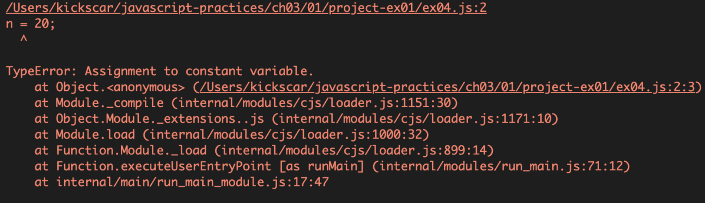

6.변수정의

## 변수선언과 변수정의

변수선언과 변수정의를 엄격히 구분하는 프로그래밍 언어도 있지만 구분하지 않거나 어휘적 선언과 내부적 정의를 함께 적용하여 구분 자체가 별 의미가 없는 프로그래밍 언어들도 많다. 프로그래밍 언어의 어휘구조를 설명하고 있으니 구분해 보는 것도 나쁘지 않다. 간단한 자바스크립트 코드로 선언과 정의를 구분해 보자.

\[예제: ex01\]

```javascript
var x;
var y = 10;

console.log(x, y);
```

1.  1번 라인은 변수에 값을 할당하지 않고 식별자로 변수의 이름만 부여하였기에 변수선언이 된다.
2.  2번 라인은 식별자로 변수이름을 부여하고 그 이름에 값을 대입하였기에 변수정의가 된다.

어휘적으로만 보면 구분은 쉽다. 하지만 실제 변수의 내용을 출력하고 자바스크립트의 언어적 의미를 따져보면 다소 혼란스럽다. 출력 결과를 보면 x가 'undefined'로 출력된다. 데이터 타입에서도 언급하겠지만 'undefined'는 자바스크립트 기본타입중 하나다. 값을 명시적(explicit)으로 대입하지 않았지만 'undefined'라는 타입의 값이 암시적(implicit)으로 대입되었다.
var x = undefined 으로 명시적인 대입도 하지만 굳이 하지 않는다. 결론은 자바스크립트도 변수선언과 변수정의를 구분하지 않는다고 볼 수 있다. 1번 라인은 어휘적으로 선언이지만 내부적으로는 정의이다.


## 키워드 var

앞의 예제에서 사용한 var 키워드는 대입 연산자 표현식 또는 식별자 앞에 붙혀 변수를 정의하는 구문을 만든다. 다음 예제로 표현식, 리터럴 그리고 변수 정의 구문 등을 확인해 보자.

\[예제: ex02\]

```javascript
10;
x;
y = 10;
var z = 20;
```

1.  1번 라인은 숫자 리터럴 표현식 구문이다. 실행에 문제가 없는 표현식 구문이다.
2.  2번 라인은 식별자 표현식 구문이다. 문제가 있는데 x라는 식별자에 어떤 값을 대입한 적이 없기 때문에 표현할 값이 없는 상태로 Reference Error 가 발생한다. 따라서 var 키워드를 사용해서 x라는 식별자를 변수로 정의해야 한다.
3.  3번 라인은 대입 연산자 표현식으로 변수 정의가 가능하다. 하지만 var가 없는 변수 정의는 약간의 혼란을 일으킬 수 있다.
4.  4번 라인은 아주 만족스러운 변수 정의 구문이다.


## 키워드 let & const

오래전 부터 있었던 var 키워드와 함께 ES6에 새롭게 추가된 let과 const 키워드는 변수 정의를 하는 키워드이다. 새롭게 변수 정의 키워드가 추가된 이유와 그 차이를 이해하기 위해서는 변수의 존재 범위인 스코프를 이해해야 한다. 스코프는 자바스크립트 엔진의 내부 작동 원리(실행컨텍스트)와 함께 이해해야 할 중요한 주제지만 우선, 변수 정의 키워드들의 이해를 돕기 위해 간단히 설명해 보자.

프로그램 실행 흐름에서 변수를 정의하면 변수는 그 때부터 존재하게 된다. 이 변수의 존재 범위를 스코프(Scope, 범위) 라고 한다. 소스 코드에서 변수가 어떤 스코프에 속하는 지 판단할 수 있는 스코프를 정적스코프라 한다. 자바스크립트는 정적스코프이고 전역스코프(Global Scope)와 함수스코프(Function Scope)가 있었지만 새롭게 추가된 변수 정의 키워드로 블록스코프(Block Scope)도 생겼다. 현재 자바스크립트의 변수는 이 세 가지 스코프를 가질 수 있다.

var 키워드는 변수를 함수의 내부에만 존재하게 하는 함수스코프를 가지도록 하는 키워드이다. 변수를 함수의 내부에서 var와 함께 정의하면 함수의 내부에서만 그 변수가 존재한다. var와 함께 정의하지 않으면 전역스코프를 가져 프로그램 아무데서나 그 변수에 접근이 가능하다. 이를 호이스팅(Hoisting)이라 하는데 다음 두 예제를 실행해 보면 금방 이해할 수 있다.

\[예제: ex03\]

```javascript
function f() {
    var i = 10;
    console.log(i);
}

f();
console.log(i); // Reference Error

```

\[예제: ex04\]

```javascript
function f() {
    i = 10;
    console.log(i);
}

f();
console.log(i); // 10
```

var를 사용하지 않고 함수 내부에서 변수를 정의했을 때 전역스코프를 가지는 문제점과 이렇게 작동하는 원리인 Hoisting이 가지는 혼란스러움 때문에 ES6에서는 새롭게 const와 let을 사용하여 변수와 상수를 정의하도록 하였다. 두 키워드는 ES6 전까지는 없었던 블록스코프를 가지도록 한다. 두 키워드 중 let은 변수 정의에 사용한다.

\[예제: ex05\]

```javascript
let k = 10;

if(k > 0) {
    let i = 100;
    i += k;
}

console.log(i);  // reference error

```

const는 값의 대입(정의)을 식별자에 한 후, 값이 변하지 않는 상수를 정의하는 데 사용한다. 상수는 한 번만 정의할 수 있는 것이 변수와 다른 점이다. 다음 예제를 보면 쉽게 이해할 수 있다.

\[예제: ex06\]

```javascript
const n = 10;
n = 20;

```

상수를 정의한 후에 값을 대입하면 'Assignment to Constant Variable' 오류가 발생한다.
